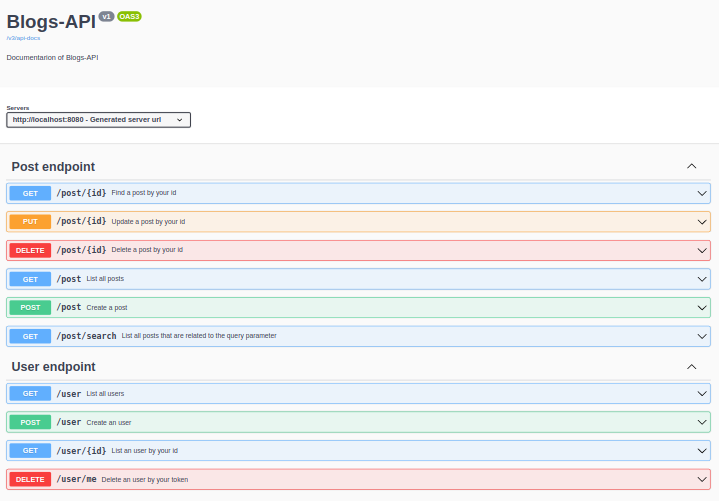

# Boas vindas ao repositório do projeto Blogs Api Spring

---

## Descrição do projeto

Neste projeto eu desenvolvi uma API de um CRUD posts de blog com Java e Spring-Boot.
</br>
Nela, eu desenvolvi alguns endpoints que estão conectados ao banco de dados PostgreSQL.
</br>
Para isso criei uma tabela para os usuários se cadastrarem na aplicação, uma tabela de categorias para os Posts e uma tabela para os Posts, guardando todas as informações dos posts realizados na plataforma.

---

## Instalação do projeto localmente

Após cada um dos passos, haverá um exemplo do comando a ser digitado para fazer o que está sendo pedido.

1. Realize o clone do projeto no diretório de sua preferência:
```javascript
git clone git@github.com:humberto-bonadiman/blogs-api-spring.git
```

2. Acesse o diretório do projeto e depois utilize o comando **mvn install** para instalar todas as dependências necessárias:
```javascript
  cd blogs-api-spring
  mvn install
```

## Adicionando o SECRET

Para realizar a criação e a leitura do token você pode utilizar o seguinte comando:
```javascript
export SECRET=sua_chave_vai_aqui
```
Não é um comando obrigatório pois a aplicação já roda sem a SECRET, porém é sempre indicado criá-la.

## Comandos para utilizar o Docker

Caso o PostgreSQL esteja ativo em sua máquina é necessário realizar o comando:
```javascript
sudo service postgresql stop
```

Para criar e iniciar os contêineres:
</br>
Obs.: Com o comando abaixo o docker fica rodando no terminal.
```javascript
docker-compose up
```

Para criar e iniciar os contêineres em stand-by:
```javascript
docker-compose up -d
```

Para realizar apenas a etapa de build das imagens que serão utilizadas:
```javascript
docker-compose build
```

Para paralisar e remover todos os contêineres e seus componentes como rede, imagem e volume:
```javascript
docker-compose down
```
---

## Utilizando o Spring-boot sem o Docker

Primeiramente, ative o PostgreSQL:
```javascript
sudo service postgresql start
```
No arquivo que está no caminho **/src/main/resources/application.properties** você deve alterar a 2ª(username) e a 3ª(password) linha com o usuário e senha do seu PostgreSQL:
```javascript
spring.datasource.username=postgres
spring.datasource.password=sua_senha_aqui
```

Rodar o Spring-Boot com o comando:
```javascript
mvn spring-boot:run
```

---

## Realização dos testes

Para realizar todos os testes da aplicação você pode utilizar o seguinte comando:
```javascript
mvn clean test
```

Para realizar somente um teste específico você deve utilizar o comando:
```javascript
mvn test -Dtest=O_nome_do_teste_vai_aqui
```

Exemplo:
```javascript
mvn test -Dtest=CreatePostApplicationTests
```

Para realizar mais de um teste basta adicionar uma vírgula ao final do teste conforme o exemplo:
```javascript
mvn test -Dtest=CreatePostApplicationTests,CreateUserApplicationTests
```

Para realizar os testes do pacote **user** você deve utilizar o seguinte comando:
```javascript
mvn test -Dtest="com.java.spring.user.**"
```

Para realizar os testes do pacote **categories** você deve utilizar o seguinte comando:
```javascript
mvn test -Dtest="com.java.spring.categories.**"
```

Para realizar os testes do pacote **post** você deve utilizar o seguinte comando:
```javascript
mvn test -Dtest="com.java.spring.post.**"
```

## Documentação



Para acessar a documentação pelo swagger rode o comando **mvn spring-boot:run** e acesse o projeto via browser, no caminho http://localhost:8080/swagger-ui/index.html ou pelo caminho http://localhost:8080/v3/api-docs.
